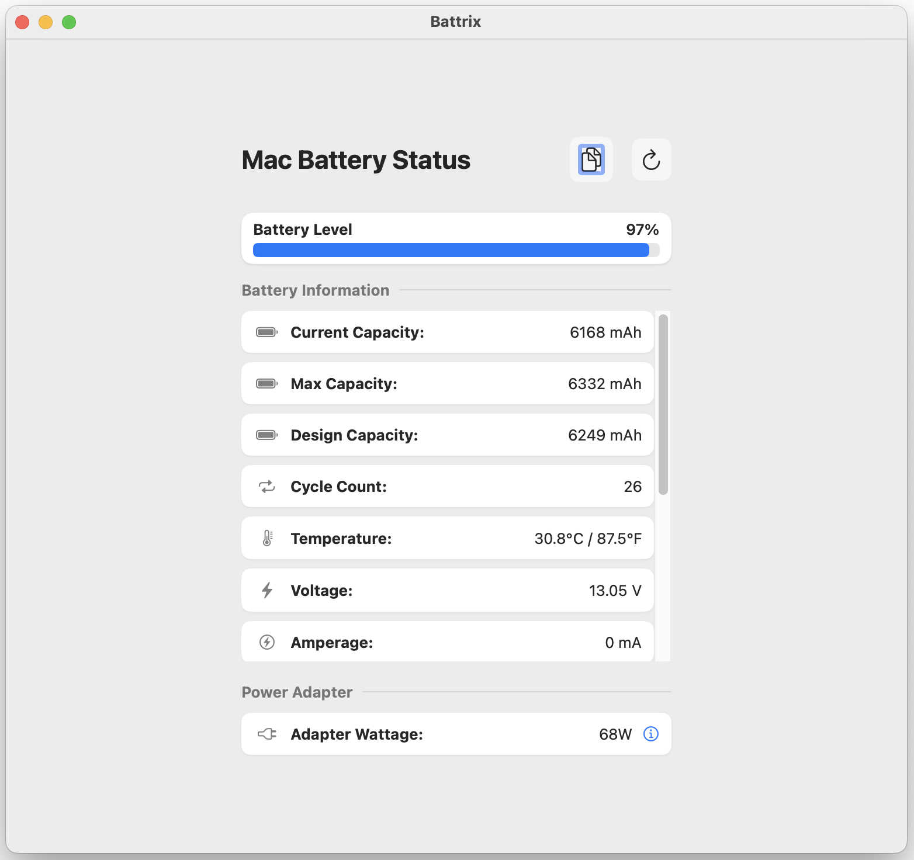

# Battrix

## Mac Battery Status Monitor

Battrix is a lightweight, native macOS application that provides detailed information about your MacBook's battery status and power adapter. It displays real-time data in a clean, user-friendly interface.





## Features

- **Real-time Battery Monitoring**:
  - Current charge percentage with visual indicator
  - Charging status and power flow indicators
  - Battery health percentage
  - Current capacity, max capacity, and design capacity

- **Detailed Battery Information**:
  - Cycle count
  - Power consumption (watts)
  - Voltage and amperage readings
  - Temperature monitoring
  - Maximum discharge current

- **Power Adapter Details**:
  - Wattage information
  - Adapter name and manufacturer
  - Voltage and current specifications
  - Serial number
  - Connection status

- **User-Friendly Interface**:
  - Clean, native macOS design
  - Visual battery level indicator with color coding
    - Green: Charging
    - Blue: Good charge level (>50%)
    - Orange: Medium charge level (20-50%)
    - Red: Low charge level (<20%)
  - Organized information sections
  - Detailed pop-up information panels

- **Additional Functionality**:
  - Copy all battery data to clipboard
  - Manual refresh with animation
  - Helpful icons for different battery metrics

## Requirements

- macOS 10.15 (Catalina) or later
- MacBook with battery (MacBook, MacBook Air, or MacBook Pro)

## Installation

### From Release

1. Download the latest release from [GitHub Releases](https://github.com/rnihesh/battrix/releases)
2. Drag Battrix.app to your Applications folder
3. Launch from Applications or using Spotlight

### Building from Source

1. Clone the repository
   ```bash
   git clone https://github.com/rnihesh/battrix.git
   cd battrix
   ```

2. Open the project in Xcode
   ```bash
   open Battrix.xcodeproj
   ```

3. Build the application (⌘+B) and run (⌘+R)

## How It Works

Battrix uses Apple's IOKit framework to access low-level battery and power information directly from your Mac's hardware. The application:

1. Connects to the "AppleSmartBattery" service through IOKit
2. Retrieves battery properties from the system registry
3. Processes and formats the raw data into user-friendly information
4. Updates the UI with real-time values
5. Calculates derived metrics like battery health and power consumption

## Privacy

Battrix operates completely offline and does not collect or transmit any data. All battery information is read locally from your system and remains on your device.

## Contributing

Contributions are welcome! Feel free to:

- Report bugs
- Suggest features
- Submit pull requests

## License

This project is licensed under the MIT License - see the LICENSE file for details.

## Acknowledgments

- Apple's IOKit framework for providing access to battery information
- SwiftUI for the modern user interface

---

Made with ❤️ by Nihesh